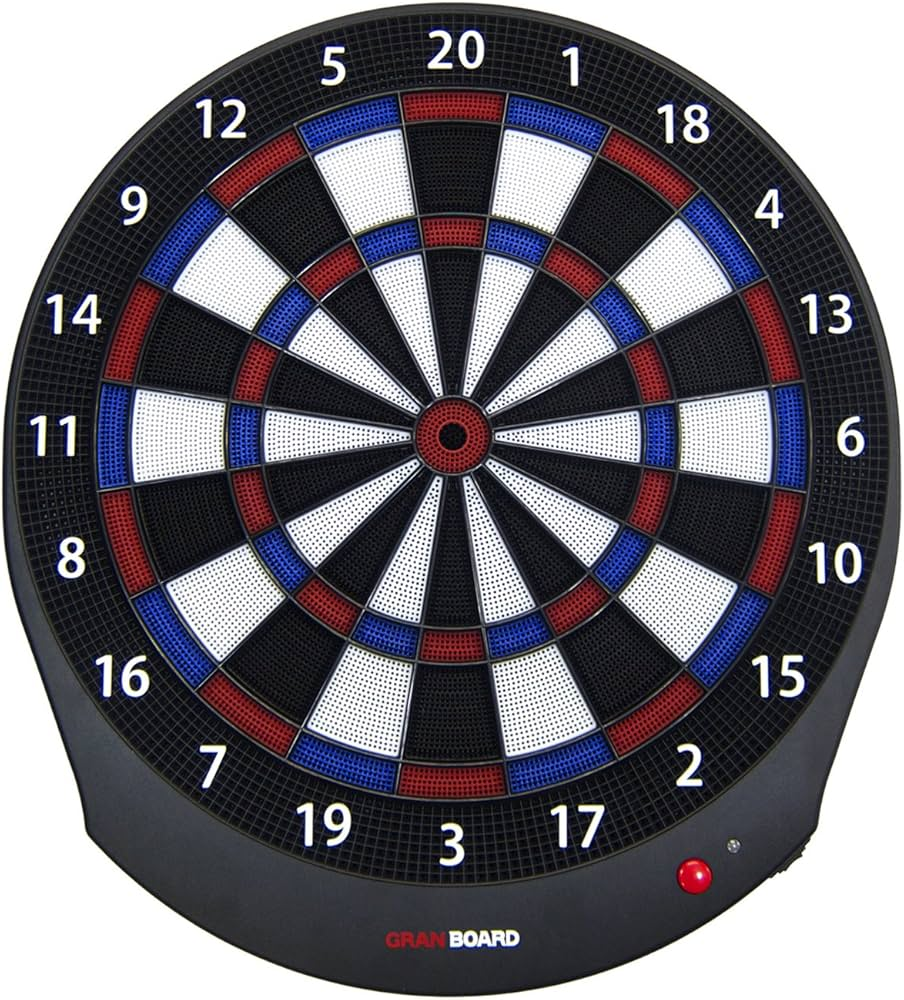

# dart game
Dart Board Game for Electronic Dart Board 



Purpose:
* Connect to electronic dart board, i.e Granboard Dash(/3s)
* Run on Raspberry Pi (3:ish)
* Kiosk mode without X11 or desktop system
* Fullscreen with Full HD
* Lots of in-game videos similar to arcade from 80s (generate with AI?)
* Gamed voices (text-to-speech?)
* Player profiles
  * Join game via QR-code (web-ui)
  * Maintain player profile incl. statistics (web-ui)
  * 
  
# Build and Run

* Java version = 21
* Java FX version = 21.0.5

## From CLI
* Build: ```./mnvw clean install```
* Run
  * Start MQtt server: ```docker-compose up```
  * Run: ```./mnvw javafx:run```